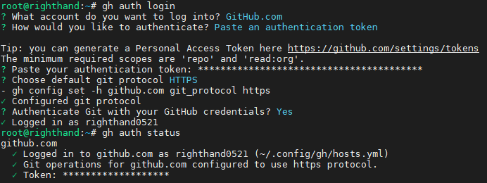

# Version Control

## [Git](https://git.github.io/htmldocs/git.html)

### Push Local Repository to [GitHub](https://github.com)

```text
1. Add 'new repository' in GitHub
2. git remote add origin https://github.com/righthand0521/<Repositories>.git
3. git push -u origin master
```

### Commands

- vim .gitconfig

```bash
[user]
    name = Yu-Chuan Cheng
    email = righthand0521@gmail.com
[core]
    symlinks = true
    longpaths = true
    autocrlf = false
[alias]
    logall = log --oneline --decorate --graph --all
[credential]
    helper = manager-core
[sendemail]
    confirm = auto
    smtpserver=msa.hinet.net
    smtpserverport=25
    # smtpserver=smtp.gmail.com
    # smtpencryption=tls
    # smtpserverport=587
    # smtpuser=<@gmail.com>
    # smtpPass=<password>
```

```bash
git config
git config --list
git config --list --local
git config --list --global
git config --list --system

git config --global user.name "Yu-Chuan Cheng"
git config --global user.email "righthand0521@gmail.com"
git config --global core.autocrlf false
git config --global core.symlinks true
git config --global color.ui auto

git config --global diff.tool vimdiff
git config --global difftool.prompt false

git config --global alias.logall 'log --oneline --decorate --graph --all'
```

```bash
git init
git clone -c core.symlinks=true git+ssh://git@<IP Address>/<Repositories>.git
```

```bash
git status
git status -bs
git status -v
```

```bash
git diff
git diff --cached
git diff HEAD^
git diff HEAD -- ./lib
git diff origin/master..master
git diff origin/master..master --stat
git diff --numstat
git diff > $(git show -s --format=%cd --date=short)_$(git rev-parse --verify HEAD --short=6).diff
```

```bash
git add .
git rm <file>
git commit -am 'commit'
git push
git push origin master
git push --progress "origin" master:master
git send-email --to <mail address> --cc <mail address> <patch file>
```

```bash
git log
git log -1
git log --stat
git log --name-status
git log -p -m
git log --pretty=format:'%h %s' --graph
git log --oneline --decorate --graph --all
git shortlog

```

- git log --pretty=format:"%h - %an, %ar : %s"

```bash
%H  該提交 SHA-1 雜湊值
%h  該提交簡短的 SHA-1 雜湊值
%T  「樹（tree）」物件的 SHA-1 雜湊值
%t  「樹」物件簡短的 SHA-1 雜湊值
%P  親代（parent）提交的 SHA-1 雜湊值
%p  親代提交簡短的 SHA-1 雜湊值
%an 作者名字
%ae 作者電子郵件
%ad 作者日期（依據 --date 選項值而有不同的格式）
%ar 作者日期，相對時間格式。
%cn 提交者名字
%ce 提交者電子郵件
%cd 提交者日期
%cr 提交者日期，相對時間格式。
%s  標題
```

```bash
git branch
git branch -a
git branch --merged
git branch --no-merged
git show-branch
git show-branch --all
```

```bash
git checkout
git checkout .
git checkout master
git checkout <tag_name>
```

### GitHub

[GitHub CLI](https://cli.github.com/)

```bash
apt-key adv --keyserver keyserver.ubuntu.com --recv-key C99B11DEB97541F0
apt-add-repository https://cli.github.com/packages
apt update
apt install gh -y
```



- [GitHub CLI：用指令就能開 issue、發 PR](https://ithelp.ithome.com.tw/articles/10240215)

### [Git Lab](https://docs.gitlab.com/ee/README.html)

#### [Install self-managed GitLab](https://about.gitlab.com/install/#ubuntu)

- vim /etc/gitlab/gitlab.rb

```bash
# external_url 'http://gitlab.example.com'
external_url 'http://<IP Address>:<Port>'

# gitlab_rails['time_zone'] = 'UTC'
gitlab_rails['time_zone'] = 'Asia/Taipei'
```

```bash
ls -l /var/opt/gitlab

gitlab-ctl start
gitlab-ctl status
gitlab-ctl restart
gitlab-ctl reconfigure

gitlab-ctl tail redis
rm -rf /var/opt/gitlab/redis/dump.rdb

gitlab-rake gitlab:check
gitlab-rake gitlab:env:info
```

- Global Setup

```bash
git config --global user.name "<Name>"
git config --global user.email <Email>"
```

- Create a New Repository

```bash
git clone http://<IP Address>:<Port>/<Repositories>.git
cd <Repositories Folder Path
touch README.md
git add README.md
git commit -m "add README"
git push -u origin master
```

- Existing Folder

```bash
cd <Existing Folder Path>
git init
git remote add origin http://<IP Address>:<Port>/<Repositories>.git
git add .
git commit -m "Initial commit"
git push -u origin master
```

- Existing Git Repository

```bash
cd <Existing Repositories Folder Path>
git remote rename origin old-origin
git remote add origin http://<IP Address>:<Port>/<Repositories>.git
git push -u origin --all
git push -u origin --tags
```

### [Git Large File Storage](https://git-lfs.com/)

## SVN: Apache Subversion

```bash
apt install subversion -y
```

```bash
svn status
svn log --verbose -r REVNO:HEAD --limit 1
svn log | sed -n '/<commiter name>/,/-----$/ p'
svn diff -r
svn diff -r REVNO:HEAD --summarize
svn diff -r $i:$j | grep revision
svn cat -r
svn add
svn ci
svnlook youngest <path>
svnadmin dump <path> -r <ver>
```

```bash
find . -iname ".svn" -print0 | xargs -0 rm -r
```

### How to create a new Repositories for SVN

- Create a new user in system (include FTP account)
  - useradd -g users $NEW_USER
  - cd /etc/vsftpd/user
  - cp example $NEW_USER
- Create a new repository
  - cd /opt/svn
  - svnadmin create $NEW_REPO
  - chown -R subversion:subversion $NEW_REPO
- Create a new svn account
  - cd /opt/svn/$REPOS_DIR/conf, ex: cd /opt/svn/Prj/conf
  - edit passwd, add new username/passwd for new account
- How to change svn url (HTTP login only)
  - vim /etc/httpd/conf.d/subversion.conf
  - modify <location /$OLD_PATH> to <location /$NEW_PATH>
  - service httpd restart
- How to change svn repository path (HTTP login only)
  - vim /etc/httpd/conf.d/subversion.conf
  - modify "SVNParentPath $OLD_PATH" to "SVNParentPath $NEW_PATH"
  - service httpd restart

### SVN Import File

```bash
svnadmin create <Project Name>
svn import --no-ignore <Source Code Path> file:///svn/<Project Name>/trunk
chown <user:group> -R <Project Name>
chmod -R g+w <Project Name>
chmod 777
```

- vim /etc/bash.bashrc

```bash
alias grepsvn='grep --color=auto -rn --exclude="*\.svn*"'
alias svnlog='svn log -v -r'
alias svndel='find -iname ".svn" -exec rm -rf {} \;'
```

## CVS: Concurrent Versions System

```bash
cvs -z5 co -d <name> <moduleName>
cvs -z5 co -D "2015-11-09 00:00:00 GMT" -d <name> <moduleName>
cvs -z5 co -r <tag> -d <name> <moduleName>
cvs up
cvs -nq up
cvs update -j
cvs update -r <version> <file>
cvs status -v <fileName>
cvs -Q status | grep -A 3 -i locally
cvs diff -r
cvs diff -c
cvs diff -Nuc
cvs ci <fileName>
cvs tag -b <tagName> .
```

- vim /etc/bash.bashrc

```bash
alias cvsst='cvs -Q status | grep -A 3 -i locally | grep Repository'
alias cvsdel='find -name CVS -exec rm -rf {} \;'
```
