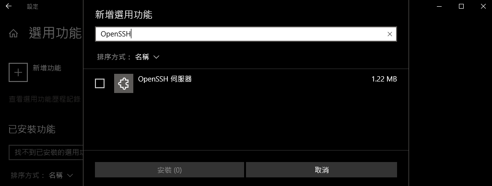

# [Microsoft Docs](https://docs.microsoft.com/zh-tw/documentation/)

## [Windows 10 安裝 OpenSSH](https://docs.microsoft.com/zh-tw/windows-server/administration/openssh/openssh_install_firstuse)

### 使用 Windows 設定安裝 OpenSSH

```text
1. 開啟 [ 設定]，選取 [應用程式] > 應用程式 & 功能，然後選取 [ 選用功能]。
2. 掃描清單，查看是否已安裝 OpenSSH。
3. 在頁面頂端選取 [ 新增功能]
 - 尋找 OpenSSH 用戶端，然後按一下 [安裝]。
 - 尋找 OpenSSH 伺服器，然後按一下 [安裝]。
安裝程式完成後，請返回 應用程式 > 應用程式 & 功能 和 選用功能 ，您應該會看到已列出 OpenSSH。
```



### 使用 PowerShell 安裝 OpenSSH

```text
請以系統管理員身分執行 PowerShell
1. 確認 OpenSSH 可供使用
> Get-WindowsCapability -Online | ? Name -like 'OpenSSH*'
如果尚未安裝，這應該會傳回下列輸出
 Name  : OpenSSH.Client~~~~0.0.1.0
 State : Installed
 Name  : OpenSSH.Server~~~~0.0.1.0
 State : NotPresent
2 安裝伺服器或用戶端元件
# Install the OpenSSH Client
> Add-WindowsCapability -Online -Name OpenSSH.Client~~~~0.0.1.0
# Install the OpenSSH Server
> Add-WindowsCapability -Online -Name OpenSSH.Server~~~~0.0.1.0
這兩個都應該會傳回下列輸出：
 Path          :
 Online        : True
 RestartNeeded : False
3. 啟動及設定 OpenSSH 伺服器
# Start the sshd service
> Start-Service sshd
# OPTIONAL but recommended:
> Set-Service -Name sshd -StartupType 'Automatic'
# Confirm the firewall rule is configured. It should be created automatically by setup.
> Get-NetFirewallRule -Name *ssh*
# There should be a firewall rule named "OpenSSH-Server-In-TCP", which should be enabled
# If the firewall does not exist, create one
> New-NetFirewallRule -Name sshd -DisplayName 'OpenSSH Server (sshd)' -Enabled True -Direction Inbound -Protocol TCP -Action Allow -LocalPort 22
4. 連接到 OpenSSH 伺服器
> ssh username@servername
5. 若要使用 PowerShell 卸載 OpenSSH 元件
# Uninstall the OpenSSH Client
> Remove-WindowsCapability -Online -Name OpenSSH.Client~~~~0.0.1.0
# Uninstall the OpenSSH Server
> Remove-WindowsCapability -Online -Name OpenSSH.Server~~~~0.0.1.0
```

## [Windows 10 上適用於 Linux 的 Windows 子系統安裝指南](https://docs.microsoft.com/zh-tw/windows/wsl/install-win10)

### 步驟 1 - 啟用 Windows 子系統 Linux 版

```text
> dism.exe /online /enable-feature /featurename:Microsoft-Windows-Subsystem-Linux /all /norestart
```

### 步驟 2 - 檢查執行 WSL 2 的需求

### 步驟 3 - 啟用虛擬機器功能

```text
> dism.exe /online /enable-feature /featurename:VirtualMachinePlatform /all /norestart
```

### 步驟 4 - 下載 Linux 核心更新套件

[WSL2 Linux 核心更新套件 - wsl_update_x64.msi](https://wslstorestorage.blob.core.windows.net/wslblob/wsl_update_x64.msi)

### 步驟 5 - 將 WSL 2 設定為預設版本

```text
wsl --set-default-version 2
```

### 步驟 6 - 安裝您選擇的 Linux 發行版本

```text
開啟 Microsoft Store，取得 Linux 發行版本
```

## [在 Windows 子系統 Linux 版 (預覽版上執行 Linux GUI 應用程式)](https://docs.microsoft.com/zh-tw/windows/wsl/tutorials/gui-apps)

## 將發行版本設定為 WSL 1 或 WSL 2

```text
> wsl --list --verbose

> wsl --set-version <distribution name> <versionNumber>
> wsl --set-version Ubuntu-22.04 2
> wsl --set-version Ubuntu-20.04 1

> wsl --set-default-version 2
```
