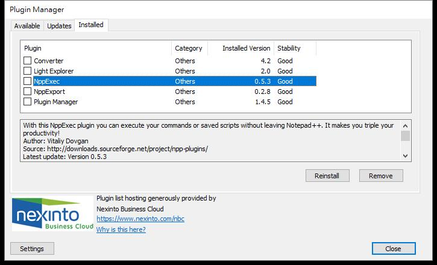
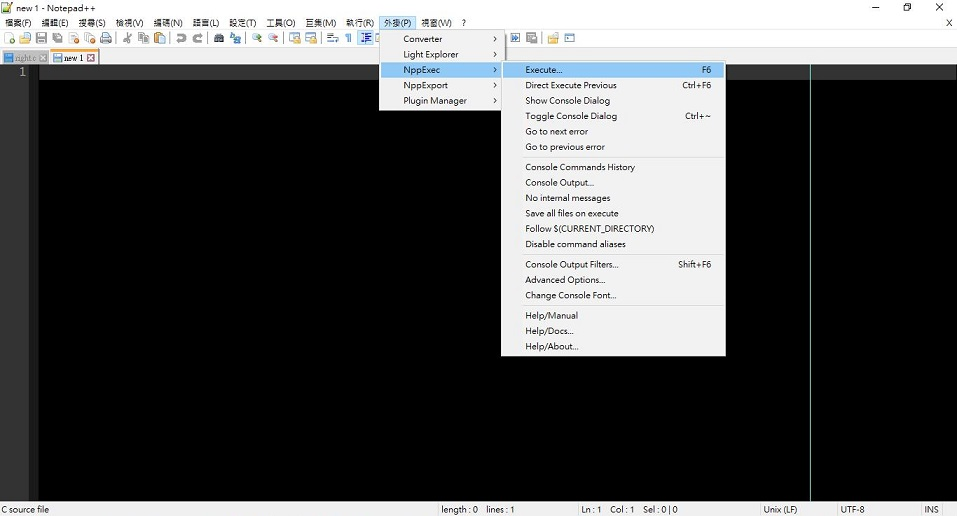
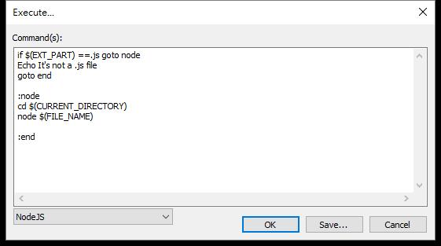
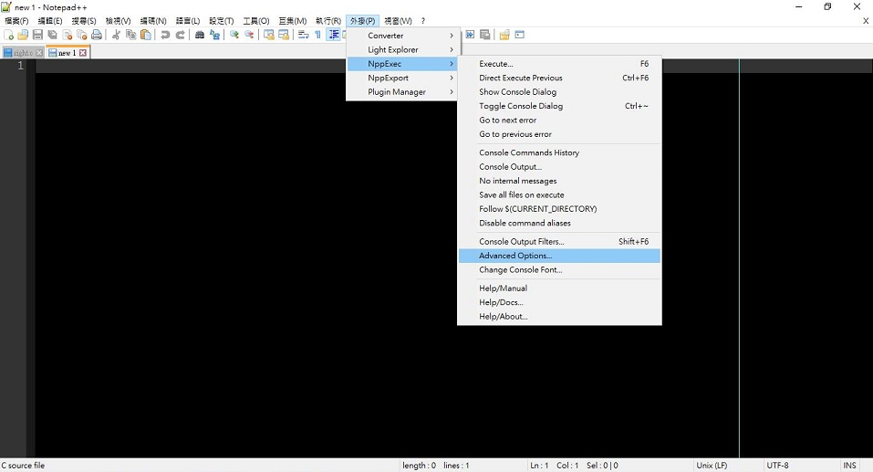
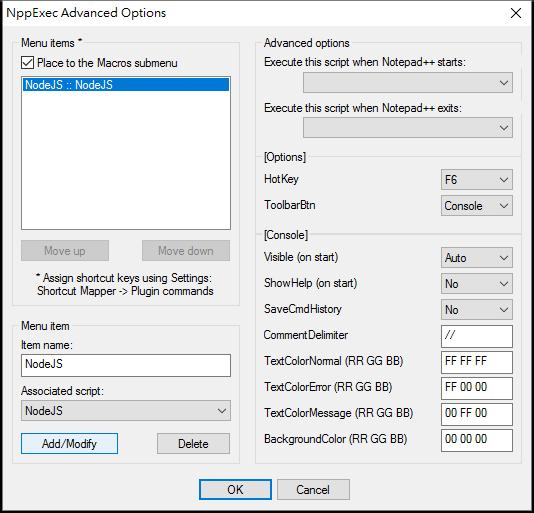
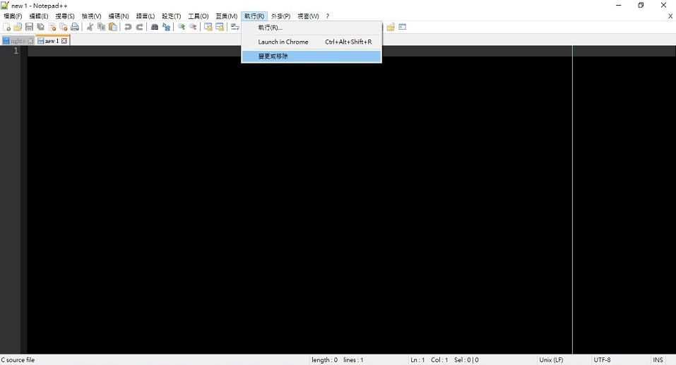
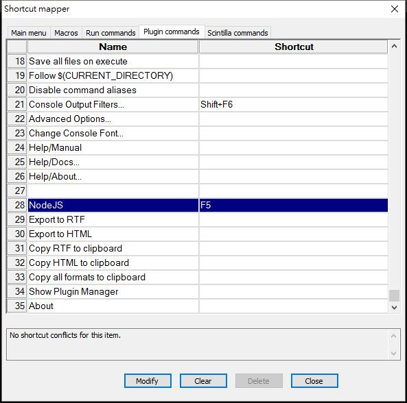

# Notepad++

## ctrl+f -> 規則運算式(E) -> 尋找內容

```text
\[[0-9]*-[0-9]*-[0-9]*\s+[0-9]*:[0-9]*:[0-9]*.[0-9]*]*\s+\R
\[[0-9]*-[0-9]*-[0-9]*\s+[0-9]*:[0-9]*:[0-9]*]\s+[\s+[0-9]*.[0-9]*]\R
```

## Plugin: NppExec



### Execute




### Execute: Node.js

```text
if $(EXT_PART) ==.js goto node
Echo It's not a .js file
goto end

:node
cd $(CURRENT_DIRECTORY)
node $(FILE_NAME)

:end
```

### Execute: Python

```text
python "$(FULL_CURRENT_PATH)"
```

### Execute: Robot Framework

```text
robot --dotted -T "$(FULL_CURRENT_PATH)"
```

### Execute: gcc

```text
cd $(CURRENT_DIRECTORY)
gcc -Wall -O3 -o $(NAME_PART).exe $(FILE_NAME) -DDEBUG=1 -g3
$(NAME_PART).exe
cmd /c del "$(NAME_PART).exe"
```

### Advanced Options -> Add Macros submenu -> Adjust 'Shortcut Mapper'






## User Define Language: Go

```text
1. copy 'go.xml' into 'plugins\APIs'(C:\Program Files (x86)\Notepad++\plugins\APIs)
2. copy 'userDefineLang.xml' into '%APPDATA%/Notepad++'(C:\Users\user\AppData\Roaming\Notepad++)
    <NotepadPlus></NotepadPlus>
3. Restart Notepad++
```
