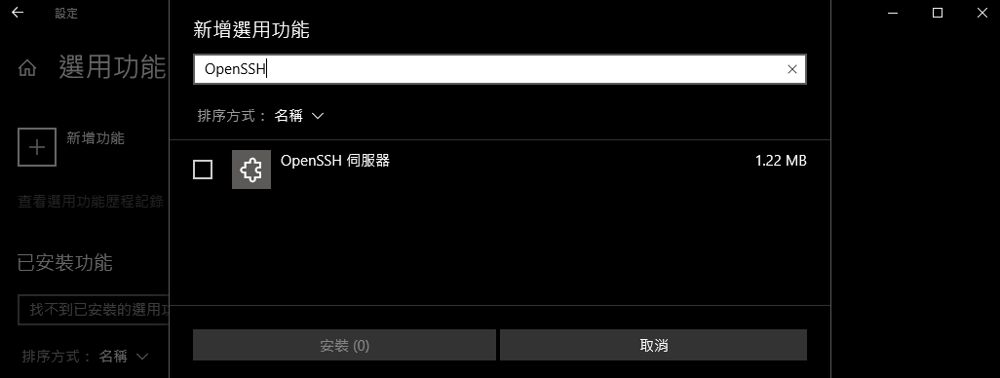

Windows
===
### [services.msc](https://zh.wikipedia.org/wiki/%E6%9C%8D%E5%8A%A1%E6%8E%A7%E5%88%B6%E7%AE%A1%E7%90%86%E5%99%A8)
---
### Windows 7 Default Dir Path is "MY Computer"
```
%WINDIR%\explorer.exe ::{20D04FE0-3AEA-1069-A2D8-08002B30309D} ， ::{20D04FE0-3AEA-1069-A2D8-08002B30309D}
```
---
### chcp 65001
### systeminfo /?    此工具可顯示本機或遠端機器的作業系統設定資訊，包括 Service Pack 等級。
### ipconfig /?
```
> ipconfig /all
> ipconfig /displaydns
> ipconfig /flushdns
```
### ping /?
```
> ping <IP> -f -l <MTU Size>
```
### net /?
```
> net use

> net use <磁碟機代號>: \\<IP or HostName>\<資料夾名稱> /user:<Domain>\<Account> <Password>
> net use z: \\192.168.1.xxx\myFiles /user:Domain\Administrator 123
> net use z: \\192.168.1.xxx\myFiles /user:Domain\Administrator ""
> net use z: /delete
```
### xcopy /?
```
> xcopy C:\xxx F:\xxx /s
  C:\xxx 為複製檔案來源位置: 例如要複製整個C槽就輸入C:\
  F:\xxx 為複製目的位置: 例如要放到F槽的備份資料夾就輸入F:\備份
  /s     為複製類型參數: 複製每個目錄及其包含的子目錄但不複製空目錄
```
### netsh /?
```
> netsh interface show interface
> netsh winsock reset

> netsh interface ipv4 set address "Ethernet 2" source=dhcp
> netsh interface ipv4 set dnsservers name="Ethernet 2" source=dhcp
> netsh interface ipv4 set winsservers name="Ethernet 2" source=dhcp
```
### netstat /?    顯示通訊協定統計資料和目前的 TCP/IP 網路連線。
### route/?    操控網路路由表
```
> route -p add 10.0.0.0 mask 255.0.0.0 192.168.0.1 metric 30 if 2
```
### tasklist /?    此工具會顯示本機或遠端電腦上，目前正在執行中的處理程序清單。
### taskkill /?    此工具可用於依據處理程序識別碼 (PID) 或影像名稱來終止工作。
### schtasks/?    讓系統管理員能夠在建立、刪除、查詢、變更，和執行，結束排程工作。
```
> schtasks /create /f /tn "TaskName" /tr "dir" /sc onstart
> schtasks /run /tn "TaskName"
> schtasks /end /tn "TaskName"
> schtasks /delete /tn "TaskName" /f
```
### type /?    顯示文字檔案的內容。
### del /?    刪除一個或多個檔案。
```
> del /s /ah Thumbs.db
```
### rd /?    移除 (刪除) 一個目錄。
```
清理資源回收筒指令
> rd /s /q %systemdrive%\$Recycle.bin
```
---
### Enable Telnet Server
```
> net localgroup TelnetClients /add
> net localgroup TelnetClients VAST-Server /add
> net localgroup TelnetClients

Change Telnet Server Auth
> tlntadmn config sec -ntlm passwd
> tlntadmn
```
---
### [Windows 10 安裝 OpenSSH](https://docs.microsoft.com/zh-tw/windows-server/administration/openssh/openssh_install_firstuse)
```
使用 Windows 設定安裝 OpenSSH

1. 開啟 [ 設定]，選取 [應用程式] > 應用程式 & 功能，然後選取 [ 選用功能]。
2. 掃描清單，查看是否已安裝 OpenSSH。
3. 在頁面頂端選取 [ 新增功能]
 - 尋找 OpenSSH 用戶端，然後按一下 [安裝]。
 - 尋找 OpenSSH 伺服器，然後按一下 [安裝]。
安裝程式完成後，請返回 應用程式 > 應用程式 & 功能 和 選用功能 ，您應該會看到已列出 OpenSSH。
```


```
使用 PowerShell 安裝 OpenSSH

請以系統管理員身分執行 PowerShell
1. 確認 OpenSSH 可供使用
> Get-WindowsCapability -Online | ? Name -like 'OpenSSH*'
如果尚未安裝，這應該會傳回下列輸出
 Name  : OpenSSH.Client~~~~0.0.1.0
 State : Installed
 Name  : OpenSSH.Server~~~~0.0.1.0
 State : NotPresent
2 安裝伺服器或用戶端元件
# Install the OpenSSH Client
> Add-WindowsCapability -Online -Name OpenSSH.Client~~~~0.0.1.0
# Install the OpenSSH Server
> Add-WindowsCapability -Online -Name OpenSSH.Server~~~~0.0.1.0
這兩個都應該會傳回下列輸出：
 Path          :
 Online        : True
 RestartNeeded : False
3. 啟動及設定 OpenSSH 伺服器
# Start the sshd service
> Start-Service sshd
# OPTIONAL but recommended:
> Set-Service -Name sshd -StartupType 'Automatic'
# Confirm the firewall rule is configured. It should be created automatically by setup.
> Get-NetFirewallRule -Name *ssh*
# There should be a firewall rule named "OpenSSH-Server-In-TCP", which should be enabled
# If the firewall does not exist, create one
> New-NetFirewallRule -Name sshd -DisplayName 'OpenSSH Server (sshd)' -Enabled True -Direction Inbound -Protocol TCP -Action Allow -LocalPort 22
4. 連接到 OpenSSH 伺服器
> ssh username@servername
5. 若要使用 PowerShell 卸載 OpenSSH 元件
# Uninstall the OpenSSH Client
> Remove-WindowsCapability -Online -Name OpenSSH.Client~~~~0.0.1.0
# Uninstall the OpenSSH Server
> Remove-WindowsCapability -Online -Name OpenSSH.Server~~~~0.0.1.0
```
---
### macshift.exe: Macshift v2.0, MAC Changing Utility
```
> macshift.exe -i NIC1 000c29fff701
```
---
